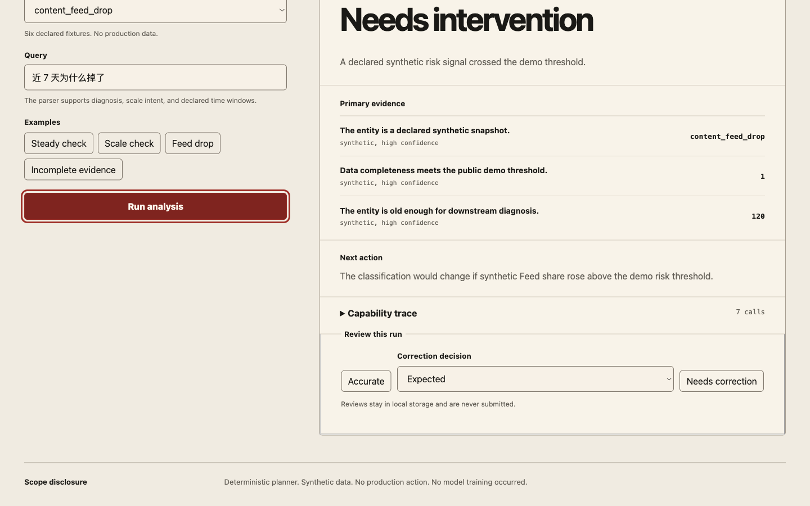
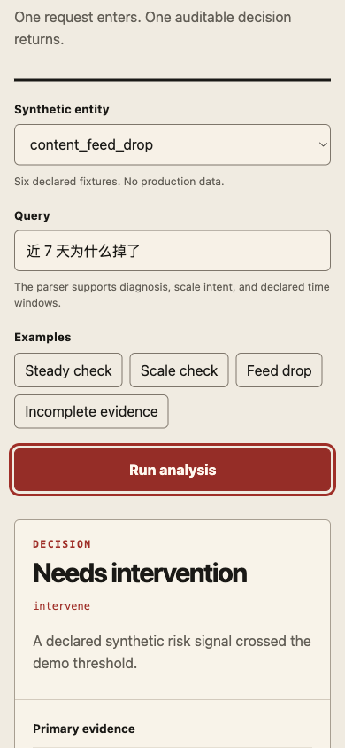
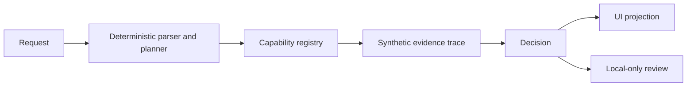

# Evidence Agent Lab

An auditable agent loop with fixed cases, explicit capability traces, and honest failure gates.

The repository is a small, runnable demonstration of how a decision can stay inspectable from request to evidence. It uses a deterministic planner and synthetic fixtures so every result can be reviewed locally.




## What happens

`input` → `capabilities` → `evidence` → `decision`

An entity ID and short query enter the deterministic planner. It selects from seven declared capabilities, records each call and its evidence, then returns one of four decisions: `expected`, `scale`, `intervene`, or `insufficient_evidence`. The UI projects that same trace without adding decision rules.

## Quick Start

```bash
npm ci
npm run verify
npm run dev
```

## Current benchmark

The checked-in snapshot at [`benchmark/latest.json`](benchmark/latest.json) contains 18 fixed synthetic cases.

| Gate | Passed | Total |
| --- | ---: | ---: |
| Request understanding | 18 | 18 |
| Capability path | 18 | 18 |
| Evidence coverage | 18 | 18 |
| Decision correctness | 18 | 18 |
| Honesty boundary | 18 | 18 |

Audit Pass Rate: 18/18 (100%)

Audit Pass Rate is five-gate conformance, including an honest `insufficient_evidence` stop. It is not model accuracy.

## Representative cases

| Case | Result | Why it passes |
| --- | --- | --- |
| `steady_7d` | `expected` | The request, capability path, evidence, decision, and boundary notes match the declared case. |
| `incomplete_data` | `insufficient_evidence` | The safety gate finds incomplete evidence and stops the run before unsupported comparisons. Honest refusal is the correct result. |

See [the complete benchmark contract](docs/benchmark.md) for all 18 cases and snapshot rules.

## Architecture



The runner owns execution and early stops; capabilities emit typed evidence; the decision builder reads the accumulated context; and the browser UI renders the resulting `AgentRun`. More detail is in [the architecture notes](docs/architecture.md).

## Boundaries

- Deterministic planner; there is no free-form model planner.
- Synthetic data only; no real records are accepted.
- Local-only reviews stored in the current browser.
- No production action or production integration.
- No model training.
- No causal uplift measurement.
- No external notification.
- No real calibration.

Read the [privacy boundary](docs/privacy.md) before running or extending the demo.

## Contributing

Start with [CONTRIBUTING.md](CONTRIBUTING.md), review the [security policy](SECURITY.md), and use the issue templates for reproducible bugs or synthetic benchmark proposals.
