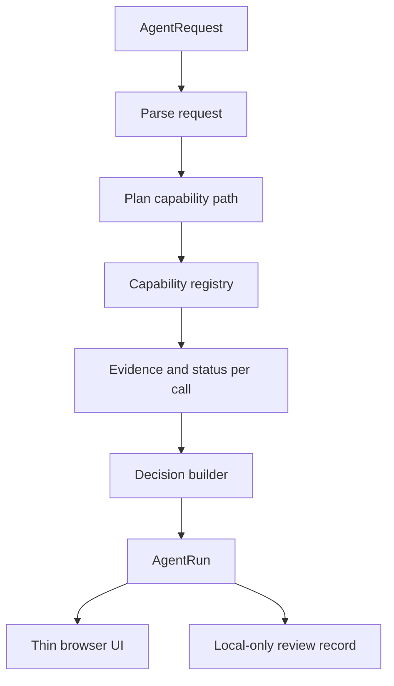

# Architecture

Evidence Agent Lab is a local, deterministic evidence loop. Its public boundary is one request in and one typed `AgentRun` out.

## Execution path

1. The parser turns an entity ID and Chinese synthetic query into a diagnosis or scale intent and a supported time window.
2. The deterministic planner declares the capability order. It does not use free-form model reasoning.
3. The runner calls the registry in order and stops when required evidence is unavailable or unsafe for the demo.
4. Each capability returns a status, a reason, and typed synthetic evidence.
5. The decision builder returns `expected`, `scale`, `intervene`, or `insufficient_evidence` from accumulated context.
6. The UI renders the same request, evidence, unknowns, falsification condition, and trace. It contains no business decision rules.
7. A reviewer may save a validated review record in the current browser. Reviews are not sent anywhere and do not alter the planner.

## Capabilities

The registry contains exactly seven capabilities:

1. `loadEntitySnapshot`
2. `checkSafetyGate`
3. `compareHistoricalBaseline`
4. `comparePeerBenchmark`
5. `attributeSignalDrop`
6. `checkDistributionPath`
7. `buildEscalationPacket`

The last capability builds a local structured packet. It does not contact a person or system.

## Boundaries

- All fixtures and evidence are synthetic.
- Planning and decisions are deterministic.
- Reviews remain local to the current browser.
- There is no production action or integration.
- There is no model training.
- There is no causal uplift measurement.
- There is no external notification.
- There is no real calibration.
- Audit Pass Rate measures conformance to five declared gates, not model accuracy.
